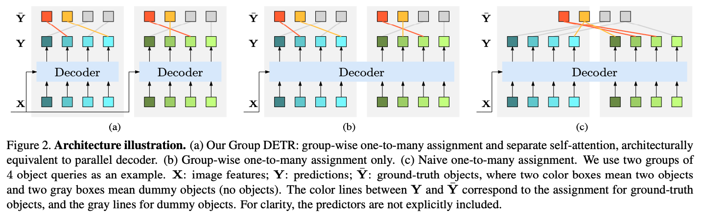
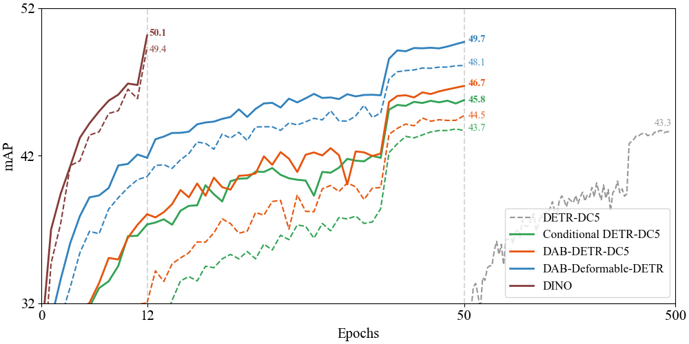

# Group DETR

This repository is an official implementation of the ICCV 2023 paper "Group DETR: Fast DETR Training with Group-Wise One-to-Many Assignment".

> [**Group DETR: Fast DETR Training with Group-Wise One-to-Many Assignment**](https://arxiv.org/abs/2207.13085)

> Qiang Chen*, Xiaokang Chen*, Jian Wang, Shan Zhang, Kun Yao, Haocheng Feng, Junyu Han, Errui Ding, Gang Zeng, Jingdong Wang

> Baidu VIS, Peking University, Australian National University


## TODO
- [ ] Update the arXiv paper
- [ ] Release code and models

## Introduction
In this paper, we introduce Group DETR, a simple yet efficient DETR training approach that introduces a group-wise way for one-to-many assignment. This approach involves using multiple groups of object queries, conducting one-to-one assignment within each group, and performing decoder self-attention separately for each group. It resembles data augmentation with automatically-learned object query augmentation, and is also equivalent to simultaneously training parameter-sharing networks of the same architecture, introducing more supervision and thus improving DETR training. The inference process is the same as DETR trained normally, and only needs one group of queries without any architecture modification. Group DETR is versatile and is applicable to various DETR variants. The experiments show that Group DETR significantly speeds up the training convergence and improves the performance of various DETR-based applications.
<div align=center>  

</div>
<div align=center>  

</div>


## Citation

If you use Group DETR in your research or wish to refer to the baseline results published here, please use the following BibTeX entry.
```BibTeX
@inproceedings{chen2023group,
      title={Group DETR: Fast DETR Training with Group-Wise One-to-Many Assignment},
      author={Chen, Qiang and Chen, Xiaokang and Wang, Jian and Zhang, Shan and Yao, Kun and Feng, Haocheng and Han, Junyu and Ding, Errui and Zeng, Gang and Wang, Jingdong},
      booktitle={Proceedings of the IEEE International Conference on Computer Vision (ICCV)},
      year={2023}
    }
```